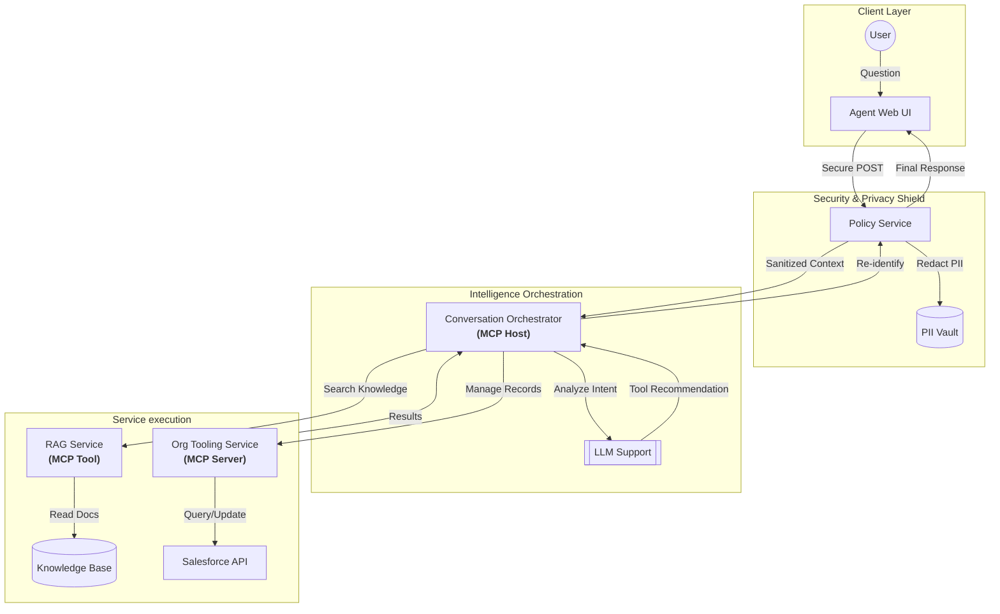

# Functional Architecture Design: Banking & CRM AI Assistant

This document outlines the functional purpose, user journeys, and core capabilities of the AI Agent with MCP.

## 1. System Purpose & Objectives

The AI Agent is designed as a specialized assistant for banking and CRM professionals. Its primary goals are:

- **Empower Knowledge Retrieval**: Provide instant, semantic search over complex banking policies and procedural documents.
- **Streamline CRM Operations**: Simplify the management of core Customer Records (Account, Contact, Lead, etc.) through natural language.
- **Ensure Data Privacy (PII)**: Protect sensitive customer data using automated redaction and tokenization during LLM interactions.
- **Safety-First Updates**: Enforce human-in-the-loop confirmation for any write actions to systems of record like Salesforce.

---

## 2. User Personas & Journeys

### User Personas

| Persona                   | Role                 | Primary Goal                                                              |
| :------------------------ | :------------------- | :------------------------------------------------------------------------ |
| **Banking Service Agent** | Frontline support    | Quickly look up "Required Documents" or "Loan Eligibility" for customers. |
| **Relationship Manager**  | CRM record owner     | Update customer contact info or check opportunity status on the go.       |
| **Compliance Officer**    | Data privacy steward | Ensure no PII (SSNs, Phone #s) is leaked to external LLM providers.       |

### Core User Journey

### Core User Journey & System Interaction

---

## 3. Core Functional Capabilities

### A. Managed Knowledge Access (RAG)

- **Semantic Search**: Goes beyond keyword matching to understand the intent of the query.
- **Multi-format Support**: Ingests and processes PDF, DOCX, and Text files into searchable knowledge chunks.

### B. Intelligent CRM Integration

- **Schema Awareness**: Dynamically describes entity fields to avoid guessing or hardcoding logic.
- **Rich Querying**: Executes complex filters to find exactly the records needed.
- **Transactional Safety**: Mandatory user confirmation for every record modification.

### C. Privacy & Security (PII Shield)

- **Zero-Leaking Context**: Personally Identifiable Information (PII) is tokenized (e.g., `[PHONE_1]`) before being sent to external LLMs.
- **Transparent Re-identification**: Re-links data only on the secure local environment before displaying the final answer to the user.

---

## 4. MCP (Model Context Protocol) Application

The system leverages **MCP** as the foundational communication standard between the AI and enterprise systems (Salesforce).

### Functional Benefits:

- **Plug-and-Play Extensibility**: New enterprise systems (e.g., ServiceNow, JIRA) can be added as new MCP Servers without changing the core Orchestrator logic.
- **Standardized LLM Interaction**: The LLM interacts with a consistent set of "Tools" regardless of the underlying backend complexity.
- **Service-Level Security**: Since the MCP Server (Org Tooling Service) handles authentication, the functional AI agent never "sees" or handles user credentials.
