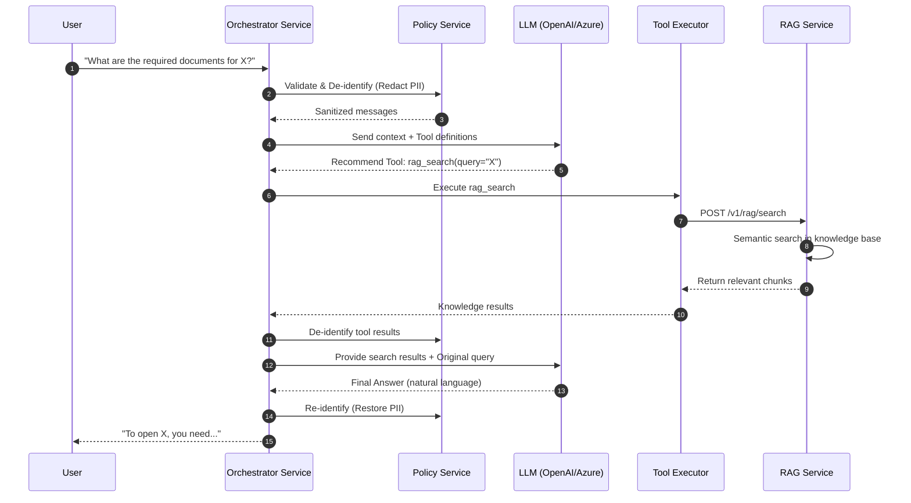

# RAG Knowledge Search Flow

This flow describes how the AI Agent retrieves information from the banking knowledge base using semantic search.

## Sequence Diagram

## Detailed Steps

1. **User Request**: User asks a question related to banking processes or documents.
2. **PII Protection**: The `Policy Service` redacts sensitive information (Names, Emails, Phones, SSNs) before the data leaves the trusted environment.
3. **LLM Decision**: The LLM reviews the masked query and decides that the `rag_search` tool is required to provide an accurate answer.
4. **Tool Execution**: The `Tool Executor` routes the request to the `RAG Service`.
5. **Vector Search**: The `RAG Service` performs a semantic search against the pre-indexed documents.
6. **Context Injection**: Relevant document chunks are returned to the `Orchestrator` and fed back to the LLM.
7. **Final Synthesis**: The LLM synthesizes the search results into a natural language response.
8. **PII Restoration**: The `Policy Service` restores the original values from the session vault so the user sees their own data correctly.
