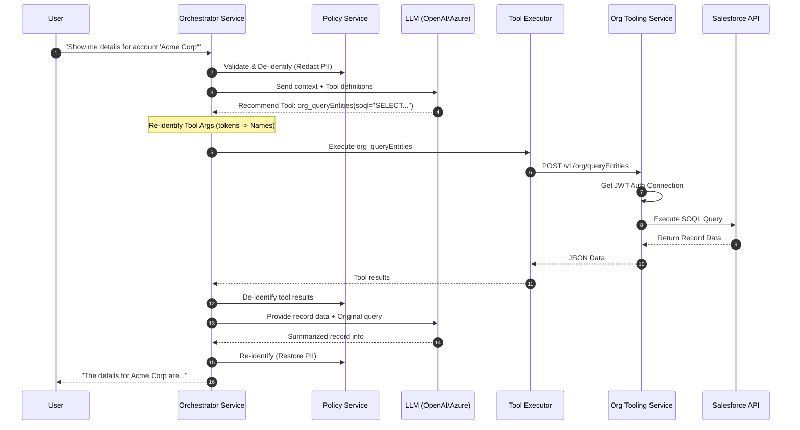

# Salesforce Data Flow

This flow describes how the AI Agent interacts with Salesforce to query or update CRM records.

## Sequence Diagram

## Detailed Steps

1. **User Request**: User asks to see, find, or update a Salesforce record.
2. **LLM Tool Selection**: The LLM identifies the need for CRM interaction and constructs a SOQL query or update payload.
3. **Token Re-identification**: If the LLM produces a query using tokens (e.g., `WHERE Name = '[NAME_1]'`), the Orchestrator restores the real names before hitting the service.
4. **Secure Connection**: The `Org Tooling Service` handles JWT-based authentication to Salesforce using a private key and Connected App credentials.
5. **API Call**: The service uses `jsforce` to execute the query or update against the Salesforce REST API.
6. **Result Processing**: Data is returned to the Orchestrator.
7. **Redaction**: Any PII in the Salesforce records (e.g., phone numbers on a contact) is automatically tokenized before being sent to the LLM for summarization.
8. **User Display**: The final summarized text is re-identified and displayed to the user.
