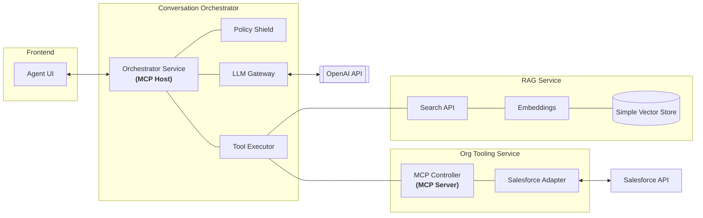

# Technical Architecture Design: AI Agent with MCP

This document provides a deep dive into the technical implementation, architecture patterns, and data flows of the system.

## 1. System High-Level Architecture

The system is built as a package-based monorepo (Lerna/Workspaces style) using Node.js and TypeScript. It follows a microservices pattern where each package has a specific responsibility.

## 1. System High-Level Architecture

The system is built as a package-based monorepo (Lerna/Workspaces style) using Node.js and TypeScript.

---

## 2. Component Detail

### A. Conversation Orchestrator (`packages/conversation-orchestrator`)

- **Role**: The central "Brain".
- **Key Services**:
  - `OrchestratorService`: Manages the multi-turn session loop.
  - `PolicyService`: Integrates `PIIDetector` for sensitive data management.
  - `LLMGateway`: Abstracts calls to completion providers (OpenAI).
  - `ToolExecutor`: Re-identifies tokens and routes calls to specialized services.

### B. RAG Service (`packages/rag-service`)

- **Role**: Information retrieval and extraction.
- **Tech**: `pdf-parse`, `mammoth` (for .docx), and a custom `SimpleVectorStore`.
- **Process**: Document -> Chunking -> Embedding (OpenAI) -> Vector Storage.

### C. Org Tooling Service (`packages/org-tooling-service`)

- **Role**: MCP (Model Context Protocol) controller for external systems.
- **Connectors**:
  - `SalesforceAdapter`: Uses `jsforce` with **JWT Bearer flow** for secure service-to-service auth.

---

## 3. Data Processing & PII Lifecycle

The system implements a **Dual-Layer Privacy Shield** to ensure LLM usage is compliant with data privacy regulations.

| Phase       | Component       | Action                                          | Result                             |
| :---------- | :-------------- | :---------------------------------------------- | :--------------------------------- |
| **Input**   | `PolicyService` | Scans user message for PII (Email, SSN, Phone). | `[PHONE_1]` stored in local vault. |
| **Turns**   | `LLMGateway`    | Sends only tokenized text to LLM.               | LLM processes safe context.        |
| **Tooling** | `ToolExecutor`  | Re-identifies tokens needed for API calls.      | Salesforce receives real data.     |
| **Output**  | `Orchestrator`  | Re-identifies LLM response before UI delivery.  | User sees real data.               |

---

## 4. Technology Stack

- **Runtime**: Node.js (v20+)
- **Language**: TypeScript
- **Web Framework**: Express.js
- **AI SDKs**: OpenAI SDK (v4+)
- **Integration**: JSForce (Salesforce), Axios.
- **Security**: JSON Web Tokens (JWT), Dotenv for secret management.
- **Testing**: Custom test scripts (Node.js).

---

## 5. Security Architecture

- **Microservice Isolation**: Each service runs on local ports (3000, 3001, 3002) but can be easily containerized.
- **JWT Authentication**: Used for Salesforce interaction, eliminating the need for hardcoded user passwords.
- **Environment Segregation**: Secrets are managed via `.env` files and never committed to version control.

---

## 6. Model Context Protocol (MCP) Implementation

This project implements MCP to decouple the LLM from specific enterprise data sources.

### MCP Role Mapping

| Component                     | MCP Role       | Responsibility                                                              |
| :---------------------------- | :------------- | :-------------------------------------------------------------------------- |
| **Conversation Orchestrator** | **MCP Host**   | Initiates the session, discovers tools, and provides the execution context. |
| **Org Tooling Service**       | **MCP Server** | Exposes Salesforce capabilities as "Tools" and "Resources".                 |
| **Tools**                     | **MCP Tools**  | `org_queryEntities`, `org_describeEntity`, `rag_search`.                    |

### Technical Benefits of MCP:

1.  **State Management**: The MCP Host manages the conversation state, while the Server remains stateless for specific Salesforce calls.
2.  **Schema Enforcement**: MCP requires strict tool definitions, ensuring the LLM always produces valid SOQL/JSON payloads.
3.  **Discovery**: In a full MCP implementation, the Host can dynamically "discover" what tools a server provides at runtime.
